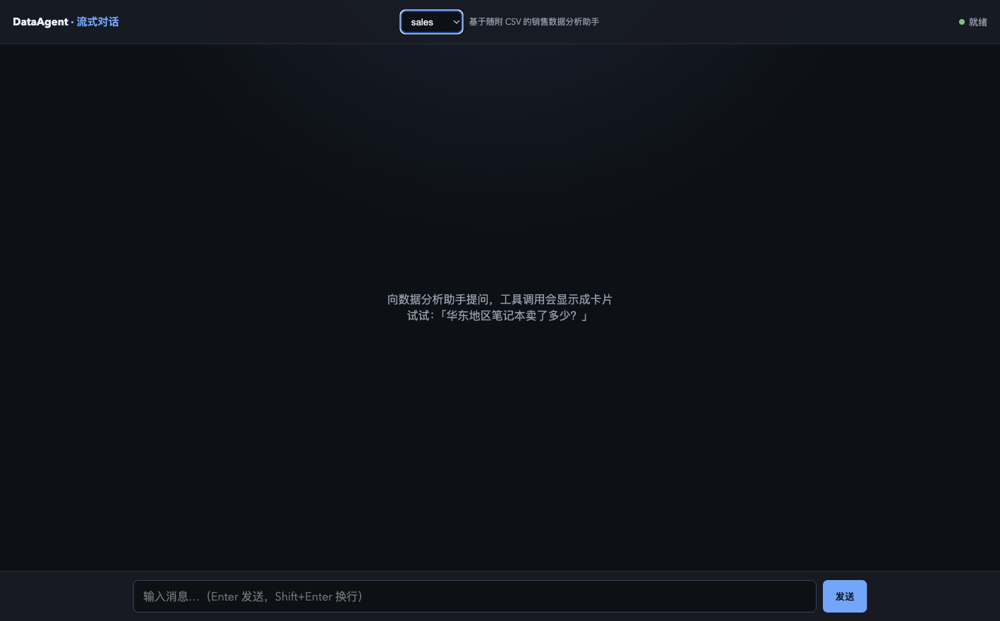

# Pi SDK Agent Pattern

一个可复制的 Pi SDK 定制 Agent 范式仓库。它把 Agent 定义、SDK 会话、工具、Skills、Web/SSE 服务和 CLI transport 分开组织，适合用来学习或快速搭建多 Agent 应用。

项目内置三个 Agent：

- `reach`：互联网调研助手，默认 Agent；
- `sales`：基于 `data/sales.csv` 的销售数据分析助手；**演示定制化agent**
- `minimal`：不依赖项目数据和 Skills 的最小助手。

## 特性

- 声明式 `AgentDefinition`：集中描述 prompt、tools、skills 和模型要求；
- `AgentManager` 按需创建并复用独立的 `AgentRunner`；
- Web 页面、JSON API、SSE 流式响应和交互式/单次 CLI；
- Agent 间及显式 session 间会话上下文隔离，支持本地文件持久化、取消、并发控制和优雅释放；
- 项目级 Skills 与工具白名单，避免未声明能力被意外启用；
- 完整的单元测试、类型检查、构建和 GitHub Actions 检查流程。

## 快速开始

要求 Node.js `>= 20.19`。

```bash
npm install
cp .env.example .env
npm start
```

启动后打开 [http://127.0.0.1:3000](http://127.0.0.1:3000)。

### Web 界面预览



已使用 Ego Browser 验证页面加载、Agent 切换、说明文字同步、就绪状态展示，以及浏览器 sessionId 的本地生成。

### 配置 Pi SDK

默认配置目录是项目根目录下的 `.pi-config/`，该目录已被 `.gitignore` 忽略。请在其中准备 Pi SDK 所需的模型和认证配置，例如 `models.json` 与 `auth.json`。不要把 API Key 或其他凭据提交到 Git。

也可以在 `.env` 中指定运行配置：

```dotenv
PORT=3000
HOST=127.0.0.1
PI_CODING_AGENT_DIR=.pi-config
PI_SESSION_DIR=.pi/sessions
PI_SESSION_MODE=continue-recent
PI_SESSION_RECOVERY=fail
PI_RESOURCE_MODE=project-only
# PI_PROVIDER=openai
# PI_MODEL=gpt-5
```

`PI_PROVIDER` 和 `PI_MODEL` 必须同时设置；不设置时，只有在可用模型恰好一个的情况下才会自动选择。`PI_RESOURCE_MODE` 支持 `project-only` 和 `inherit-user-resources`，默认使用 Agent 定义值或 `project-only`。

会话默认持久化在项目根目录 `.pi/sessions/<agentId>/<sessionId>/`，默认恢复最近会话。设置 `PI_SESSION_MODE=memory` 可关闭持久化；也可用 `PI_SESSION_DIR` 指定会话根目录。损坏或不可读的历史会话默认使启动失败，避免静默丢失上下文；只有明确设置 `PI_SESSION_RECOVERY=new` 时才会记录警告并创建新会话。`.pi/` 可能包含敏感对话内容，已加入 Git 忽略。

清理历史会话时，请先停止服务，再删除明确的 `.pi/sessions/<agentId>/<sessionId>/` 子目录；程序默认不自动清理。备份时将 `.pi/sessions/` 与 `.pi-config/` 分开处理，导出对话时不得包含 `.pi-config/auth.json`、`models.json` 或 API Key。

### Web 与 CLI

```bash
# 指定 Web 初始 Agent
npm start -- --agent minimal

# 单次 CLI 调用
npm run cli -- --agent minimal "解释什么是流式响应"
# 使用指定的持久化会话
npm run cli -- --agent minimal --session work "继续上次的问题"
npm run cli -- "对比华东和华南销售额"

# 进入交互式 CLI；输入 /agent 查看或切换 Agent
npm run cli
```

交互式 CLI 中可使用 `/agent` 查看列表、`/agent sales` 切换 Agent，输入 `exit` 或 `quit` 退出。切回 Agent 时会继续使用它原有的进程内上下文。

## HTTP API

查看可用 Agent：

```bash
curl http://127.0.0.1:3000/agents
```

发送消息。响应为 Server-Sent Events，事件类型包括 `text`、`thinking`、`tool_start`、`tool_end`、`error` 和 `done`：

```bash
curl -N http://127.0.0.1:3000/chat \
  -H 'Content-Type: application/json' \
  -d '{"agentId":"sales","message":"华东和华南哪个区域销售额更高？"}'
```

`agentId` 可省略，默认使用 `reach`；`sessionId` 可选，默认使用启动参数或 `default`。非法请求返回 `400`，同一 Agent + session 同时执行多个请求返回 `429`，服务关闭期间返回 `503`。浏览器页面会把随机 sessionId 保存在当前浏览器的 localStorage 中；这提供浏览器级上下文隔离，不等同于认证用户或多租户安全边界。

## 架构

```text
Web / CLI → AgentManager → AgentRunner + StreamEvent
                         → AgentDefinition → Pi SDK + tools + skills
```

- `src/agent/definition.ts`：无状态 Agent 声明契约；
- `src/agent/runner.ts`：唯一的 SDK 会话适配、持久化和生命周期实现；
- `src/agent/manager.ts`：Agent 发现、Runner 按需创建/复用和统一释放；
- `src/agent/registry.ts`：Web 和 CLI 共用的 Agent 注册表；
- `src/events.ts`：入口消费的稳定项目事件，不泄漏 SDK 原始事件；
- `src/tools/query-data.ts`：CSV 加载、查询、格式化和 SDK 工具包装；
- `src/server.ts`、`src/cli.ts`：仅负责 transport，不包含领域逻辑；
- `skills/`：项目级 Skills 及其参考资料；
- `test/`：Agent、配置、事件、会话、API 和工具测试。

## 创建 Agent

在 `src/agent/` 新建模块并导出定义，然后只在 `src/agent/registry.ts` 增加一项：

```ts
export const supportAgentDefinition: AgentDefinition = {
  id: "support",
  description: "产品支持助手",
  systemPrompt: "只依据已授权资料回答。",
  tools: [supportSearchTool],
  activeToolNames: ["support_search"],
  resourceMode: "project-only",
};
```

Runner、Web 和 CLI 无需修改。若定义固定模型，必须同时写 `{ provider, id }`。工具的领域逻辑建议先写成纯函数，再用 SDK `defineTool` 包装 schema 和执行函数，并同时加入 `tools` 与 `activeToolNames`。

## 开发与质量检查

```bash
npm run dev          # 监听源码并启动 Web 服务
npm run check        # format、测试、typecheck、build
npm run eval         # prompt/tool/data/越权基线测试
npm run build        # 编译到 dist/
npm run start:prod   # 运行构建产物
```

自动化测试不连接真实 provider。SDK 版本固定为 `0.83.0`，GitHub Actions 在 push 和 pull request 上运行 `npm run check`。

当前示例中的教学 CSV parser 不支持带引号字段、字段内逗号或字段内换行；通用场景应替换为成熟 parser 并补充相应测试。

## 相关文档

- [迁移与历史记录](docs/history.md)
- [Agent 范式优化计划](docs/agent-pattern-optimization-plan.md)
- [Agent 选择优化计划](docs/agent-selection-optimization-plan.md)
- [Pi Agent Skill](skills/dg-piagent/SKILL.md)

本项目是本地教学和原型示例，不能直接视为生产环境的认证、授权或多租户方案。
